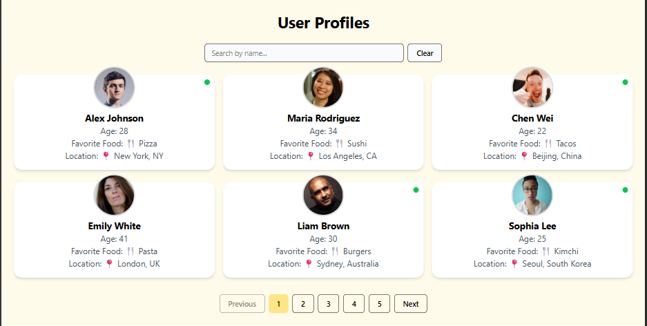

USER PROFILES SPA

PROJECT OVERVIEW

This is a single-page application that displays a list of user profiles.

The application fetches user data from a local JSON file and displays it in a clean, responsive grid of cards. It includes a search feature to filter users by name and adds simple pagination to improve the user experience. The following is the screenshot of the user profiles

---

KEY FEATURES

- Responsive user cards: Each user's information is displayed on a styled card that adapts to different screen sizes.
- Search & Filter: Easily find a specific user by typing their name in the search bar. The green dot on the cards indicate if the user is online.
- Pagination: The app displays 6 users per page to keep the layout clean and easy to navigate.
- Clean Design: The user interface is built with Tailwind CSS and shadcn/ui for a modern and professional look and feel.

---

TECH STACK

- React
- Vite
- Tailwind CSS v4
- shadcn/ui

---

How to Run the Project

Follow these simple steps to get the application running on your local machine:

1. Clone the repository
2. Install the dependencies: npm install
3. Start the development server: npm run dev
